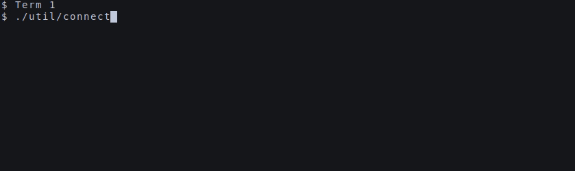

# aws-simple-websocket

Using AWS's API Gateway + Lambda + Python to run a simple websocket application. For learning/testing. The AWS Resources
seemed overly complex and were missing some critical gotchas in setting up a system like this.



Using the following for guidance:

* [AWS Blog: Announcing WebSocket APIs in Amazon API Gateway](https://aws.amazon.com/blogs/compute/announcing-websocket-apis-in-amazon-api-gateway/)
* [GitHub: aws-samples/simple-websockets-chat-app (Node.JS + SAM)](https://github.com/aws-samples/simple-websockets-chat-app)

## Architecture

To keep things as basic as possible we're using a bare minimum of resources and CLI helpers where possible.

A **client** makes a connection via Websocket to an **API Gateway V2**. That gateway maintains a socket connection for
us, and sends events to some sort of "integration" or handler. In our case, this will be a **Lambda** function that will
handle the incoming socket events (**$connect**/**$disconnect**). It will handle messages sent from websocket clients,
and to further expand this example, an outside data source via **SNS** topic. The API Gateway requires us to keep track
of Connection IDs, so we can programmatically and precisely send messages to specific clients.

Using Terraform (in `./deployment`) the following are created:


1. **API Gateway V2 (Websocket)** - The primary Websocket management service which holds sockets for connections and can
   hit a variety of AWS integrations

1. **Lambda** - The main executor of business logic - where all our code will live

1. **S3** - A basic Key/Value store for our connections

1. **SNS** - To demonstrate an external publisher, our Lambda function is also listening to an SNS Topic

Some additional resources are needed:

1. **CloudWatch** - Logging for API Gateway and Lambda function with retention periods set by default

1. **IAM** - Permissions to glue everything together

## Deployment

This demo repo uses Terraform to manage cloud resources. These are all stored in the `./deployment` repository.
**NOTE:** Creating resources in AWS may incur charges to your account. Ensure you have billing alarms setup and
understand AWS costs. This demo repo should cost almost nothing, however.

1. [Install Terraform](https://learn.hashicorp.com/tutorials/terraform/install-cli)
1. Change to `./deployment` directory
1. Init Terraform (`terraform init`)
1. It's best practice to use "Workspaces" to namespace resources in terraform for different environments, so create
   a `dev` workspace (`terraform workspace new dev`)
1. Check if you need to
   enable [API Gateway Logging](https://aws.amazon.com/premiumsupport/knowledge-center/api-gateway-cloudwatch-logs/) in
   your current region. Feel free to set `./deployment/enf.tf:init_api_gw_logging_role` to false if your account already
   has this setup
1. Create the resources `terraform apply`
1. Run `/util/lambda-deploy dev` to build and deploy the lambda code. There are no external dependencies, just `boto3`

## Usage

Contained in `./util` are a lot of small CLI scripts to allow us to interact with the system without bloating the core
too much with things like static web pages for the app side.

* **lambda-build** - builds a zip archive for deployment to Lambda

* **lambda-deploy** - runs `lambda-build` and deploys the archive to the provided Lambda environment. Uses `terraform` 
  to get the name of our Lambda function to deploy to

* **send-data [json]** - Sends a JSON payload to connected clients via SNS Topic. Uses `terraform` to get the name of
  our SNS Topic
  
* **tail-logs** - Watches logs for the API Gateway and Lambda function. Uses `terraform` to get the name of
  our the log groups
  
* **connect** - Connect to the websocket using a small utility, [websocat](https://github.com/vi/websocat) 

### Quick Example

 1. Deploy the stack using the above instructions.
 1. `./util/connect` to connect and listen to the websocket
 1. Using a new terminal session, `./util/send-data '{"hello": "world"}'`
 1. View that in your first terminal with connect running, you'll see `{"hello": "world"}`

Users can broadcast messages to other users as well, not just through SNS. With a connected client, send: 
```json
{"action": "broadcast", "message": "Good news, everyone!"}
```
You will then see: `{"message": "Good news, everyone!"}` in all the connected clients.

## Improvements

1. Move from `print()` to `logging` module, for the sake of keeping this really simple, I left print in there
