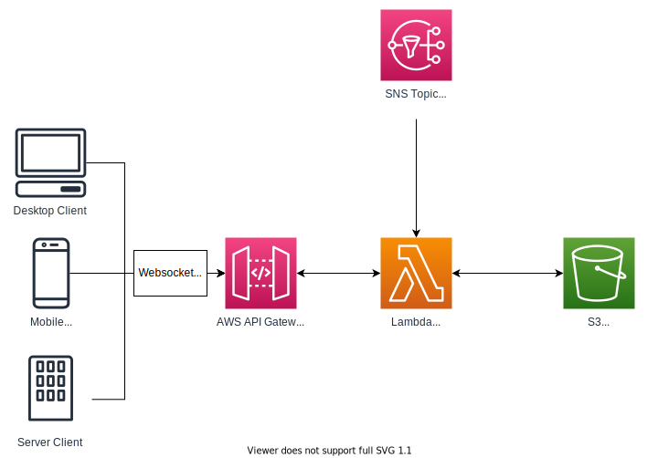

# aws-simple-websocket

Using AWS's API Gateway + Lambda + Python to run a simple websocket application. For learning/testing. The AWS Resources
seemed overly complex and were missing some critical gotchas in setting up a system like this.

Using the following for guidance:

* [AWS Blog: Announcing WebSocket APIs in Amazon API Gateway](https://aws.amazon.com/blogs/compute/announcing-websocket-apis-in-amazon-api-gateway/)
* [GitHub: aws-samples/simple-websockets-chat-app (Node.JS + SAM)](https://github.com/aws-samples/simple-websockets-chat-app)

## Architecture

To keep things as basic as possible we're using a bare minimum of resources and CLI helpers where possible.

A **client** makes a connection via Websocket to an **API Gateway V2**. That gateway maintains a socket connection for
us, and sends events to some sort of "integration" or handler. In our case, this will be a **Lambda** function that will
handle the incoming socket events (**$connect**/**$disconnect**). It will handle messages sent from websocket clients,
and to further expand this example, an outside data source via **SNS** topic. The API Gateway requires us to keep track
of Connection IDs, so we can programmatically and precisely send messages to specific clients.

Using Terraform (in /deployment) the following are created:

1. **API Gateway V2 (Websocket)** - The primary Websocket management service which holds sockets for connections and can
   hit a variety of AWS integrations

1. **Lambda** - The main executor of business logic - where all our code will live

1. **S3** - A basic Key/Value store for our connections

1. **SNS** - To demonstrate an external publisher, our Lambda function is also listening to an SNS Topic

Some additional resources are needed:

1. **CloudWatch** - Logging for API Gateway and Lambda function with retention periods set by default

1. **IAM** - Permissions to glue everything together
